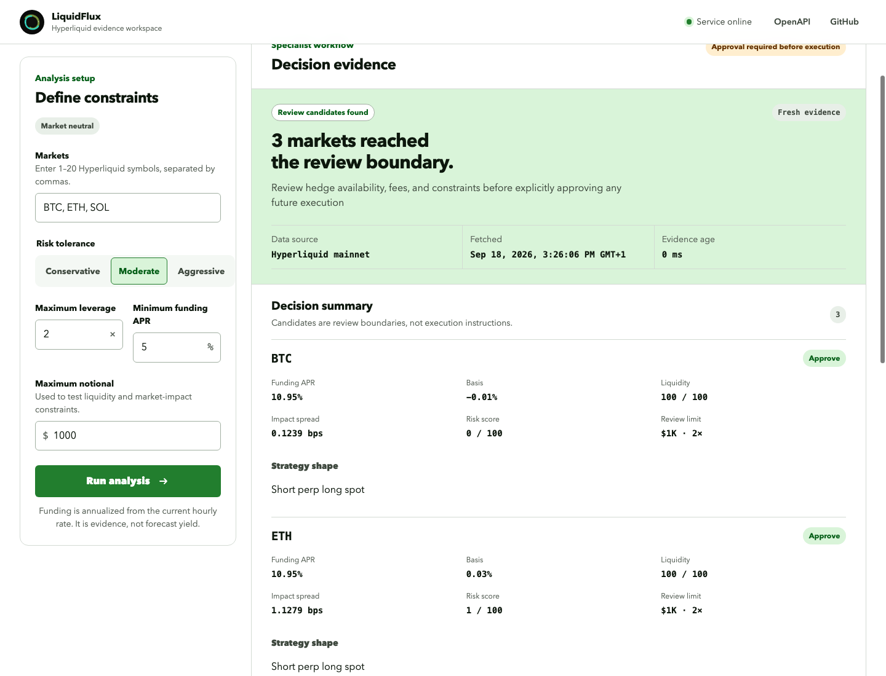
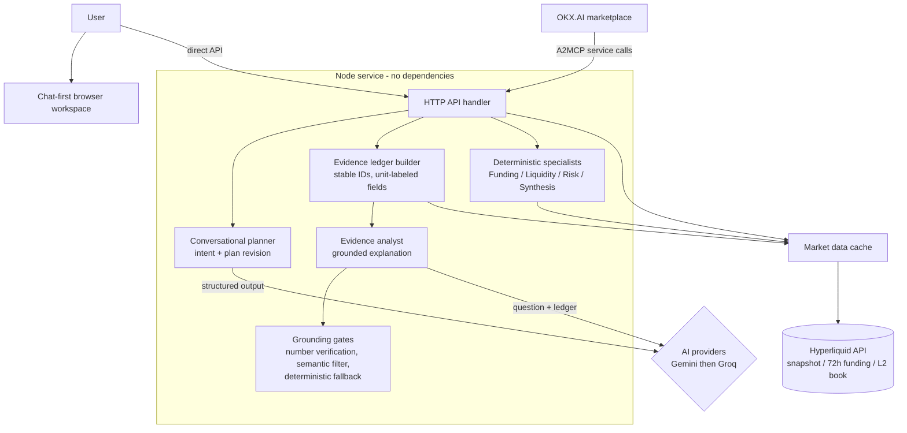

# LiquidFlux

## Chat-first workspace

The conversation is the main interface. Ask a market question or request a strategy; LiquidFlux presents the relevant confirmation inline. Market answers combine the current snapshot, 72-hour realized funding behavior, and visible order-book evidence. AI findings cite server-issued evidence IDs; deterministic facts and limitations remain available if AI analysis fails. Earlier results stay in the thread as collapsed snapshots. Manual strategy controls and resource links are under **Tools & service details**.

Local UI verification: `node scripts/browser-smoke.js` runs bounded desktop (1440×1000) and mobile (390×844) Chrome checks using fixture planner replies and market data. It checks both flows, archived evidence, duplicate IDs, runtime errors, and horizontal overflow. Requires Google Chrome at the standard macOS application path; screenshots go to ignored `.tmp/`. This checks UI behavior, not live-model accuracy.

LiquidFlux is a read-only Hyperliquid information and strategy-analysis service distributed through OKX.AI. Its product goal is conversational market information without an implicit strategy, plus separately reviewed market-neutral strategy analysis. Deterministic first-party Funding, Liquidity, Risk, and Synthesis modules process market evidence; configured AI providers interpret requests and explain a server-built evidence ledger. Displayed numeric findings are generated deterministically from the ledger, not by the model. AI prose (answer and caveats) may quote ledger numbers, but every numeric token is verified against trusted code-extracted values: exact-precision match required, % signs allowed only on `_percent`/`_fraction`-derived fields, and numbers scoped to the symbol mentioned in the sentence. Model unit conversions, invented figures, and prescriptive wording are rejected sentence by sentence; a deterministic grounded conclusion is shown if all model prose is rejected. Transient provider rate-limit/server errors are retried once before analysis is reported unavailable. Citation validation proves referenced records exist; it does not independently fact-check model prose.

**Status (2026-09-22):** `market_information`, `POST /api/v1/market-overview`, and short-reply support are implemented and deployed. All 117 automated tests and syntax/JSON checks pass. Version `0.7.8` is verified live on Render: a detailed evidence question returned a five-sentence grounded answer quoting exact ledger figures (snapshot and 72-hour rates, retrospective APR, visible-level limits) that all passed the number-grounding gate, via Groq. Direct live Hyperliquid BTC funding-history and L2-book calls passed, plus fixture-backed desktop/mobile Chrome journeys. Gemini (`gemini-3.6-flash`) is verified live with a real key; its free-tier quota is small, so Groq fallback remains load-bearing (see Evidence and security limitations). Strategy approval is a browser workflow, not API authorization. No external paid specialist, payment, or trade execution is implemented. See [`AUDIT.md`](AUDIT.md) for code-grounded gaps and validation requirements. The URLs and marketplace records below are historical project references, not freshly verified by this audit.

- **Live dashboard:** https://hyperdesk-scout.onrender.com
- **Live API origin:** https://hyperdesk-scout.onrender.com
- **Health:** https://hyperdesk-scout.onrender.com/health
- **OpenAPI:** https://hyperdesk-scout.onrender.com/openapi.json
- **Conversational planner:** `POST https://hyperdesk-scout.onrender.com/api/v1/plan` — provider-backed intent/planning endpoint; intent/planning endpoint
- **Orchestrator:** `POST https://hyperdesk-scout.onrender.com/api/v1/orchestrate`
- **OKX.AI ASP:** LiquidFlux, Agent ID `13784` — resubmitted with two free A2MCP services; listing review is pending. The paid report remains a separate direct testnet API.

## Product direction

Existing marketplace products already expose individual Hyperliquid analytics, risk, and execution capabilities. LiquidFlux is therefore evolving from a standalone scanner into the orchestration layer that selects specialist stages, combines their evidence, reports conflicts, and stops at an explicit execution-approval boundary.

[`OKX_AI.md`](OKX_AI.md) records free Funding Specialist and Market-Neutral Orchestrator A2MCP publication and buyer-side invocations on 2026-09-18, plus the paid Hyperliquid Research Report’s later publication, X Layer testnet rejection, removal, and direct payment evidence. Agent `13784` is under review with only the two free services; the paid report remains available directly, not through the current marketplace submission. These records support distribution of LiquidFlux's own services, not third-party specialist hiring. In code, the orchestrator calls local modules directly; it does not invoke them through OKX.AI. [`STRATEGY.md`](STRATEGY.md) contains the broader direction, including future A2A/payment ideas; [`AUDIT.md`](AUDIT.md) distinguishes these from implemented behavior.



## Architecture



Trust boundaries: deterministic code fetches data, computes evidence, and verifies every number the AI quotes; AI providers only interpret requests and explain the ledger. The browser review step gates strategy runs; no wallet, payment, or execution path exists in this version.

## Research workspace

The dependency-free dashboard is served by the existing Node service. Its conversational workspace calls `POST /api/v1/plan` to create, refine, or explain the active plan, but it calls `POST /api/v1/orchestrate` only after explicit plan approval. It includes:

- An in-session, bounded natural-language conversation with Gemini preferred and Groq fallback. Both adapters use documented structured-output contracts and both are verified live: Gemini (`gemini-3.6-flash`) completed a full grounded analysis with a real key; Groq (`openai/gpt-oss-20b`) is verified in production
- Follow-up plan revisions that preserve validated current constraints
- Initial evidence-grounded analysis after a confirmed fetch: snapshot data, 72-hour funding persistence, visible L2-book notional, and validated finding citations
- Compact plan summaries in the conversation plus editable deterministic controls and a manual fallback
- A real objective-and-constraints workflow for market-neutral Hyperliquid income analysis
- Pre-run specialist planning with provider identity, OKX.AI listing status, service cost, and explicit approval
- Honest separation between the marketplace-listed Funding Specialist, first-party modules, and the unconnected external-service slot
- Stage-aware loading, actionable errors, first-run guidance, and no-op outcomes
- Candidate and rejection reasoning before raw specialist evidence
- Expandable Funding, Liquidity, and Risk outputs with the complete structured response
- Visible provenance, freshness, workflow trace, and execution-approval boundary
- Responsive desktop and mobile layouts, keyboard focus, and reduced-motion support

No wallet connection, paid specialist call, or trade execution is included. A confirmed information request can make up to two additional Hyperliquid `/info` calls per enriched symbol (maximum five symbols, cached for 60 seconds) and one configured AI analysis call. The original question and bounded server-built evidence ledger are sent to the selected AI provider; provider usage can incur operator cost. The planner itself does not fetch market data, but can receive client-supplied result context. The browser review action does not run market analysis; approving it calls the free first-party orchestration endpoint. Direct API callers can call that endpoint without an approval receipt. Gemini/Groq usage can incur operator costs and sends submitted context to configured providers, including fallback; it is separate from marketplace fees or future x402 spend.

## Run

Requires Node.js 20 or newer and no third-party packages.

```bash
npm start
```

Health check:

```bash
curl http://localhost:3000/health
```

AI-assisted objective planning (requires at least one configured provider key):

```bash
curl -X POST http://localhost:3000/api/v1/plan \
  -H 'Content-Type: application/json' \
  -d '{"message":"Find a low-risk market-neutral opportunity using no more than $1,000"}'
```

Orchestrated market-neutral analysis:

```bash
curl -X POST http://localhost:3000/api/v1/orchestrate \
  -H 'Content-Type: application/json' \
  -d '{"objective":"market_neutral_income","symbols":["BTC","ETH","SOL"],"risk_tolerance":"moderate","max_leverage":2,"max_notional_usd":1000}'
```

Funding specialist:

```bash
curl -X POST http://localhost:3000/api/v1/funding-scan \
  -H 'Content-Type: application/json' \
  -d '{"symbols":["BTC","ETH","SOL"],"min_funding_apr":5,"risk_tolerance":"moderate"}'
```

## API

The machine-readable OpenAPI 3.1 contract is available in [`openapi.json`](openapi.json) and is served at `GET /openapi.json`.

### `POST /api/v1/plan`

Uses configured providers in preference order (Gemini, then Groq by default). Requests contain `message` and optionally up to 12 user/assistant `conversation` turns, a complete validated `current_plan`, and bounded `analysis_context`. The planner does not fetch Hyperliquid data and returns `execution_included: false`.

**Intent-specific contract:** `market_information` returns symbols/topics without a financial strategy; only `plan_update` returns complete strategy constraints and `suggested_defaults`. Other intents include result explanation, clarification, and unsupported requests. Short replies must resolve against context without turning information into a strategy. Provider/model identity and concise replies accompany results. Only plan updates carry a specialist plan. The compatibility flag `approval_required` remains metadata; the browser separately confirms free information fetches and reviews strategy runs. Default disclosure is model-reported, not independently established field provenance.

If neither key is configured, the endpoint returns `503 ai_unavailable`; the dashboard remains usable through its manual controls. If all configured providers fail, it returns the opaque `502 ai_provider_unavailable` error without exposing provider responses or keys.

### `POST /api/v1/market-overview`

The local implementation accepts required `symbols` (1–50) and optional `topics` drawn from `funding`, `basis`, `liquidity`, and `risk`. It returns a read-only snapshot with `query`, `evidence`, per-market `facts`, `calculations`, and `notices`, plus `execution_included: false`. Missing values are null, not synthetic zeroes. It does not accept investment constraints or rank strategy candidates. Browser integration, OpenAPI alignment, tests, and deployment must be validated together before treating this as a released capability.

### `POST /api/v1/research-report`

The paid tier, gated by the **OKX Agent Payments Protocol** (x402 v2). Accepts `symbols` (1–5) and an optional `question` (a default research prompt is used when omitted). Returns the full enriched overview — snapshot facts, 72-hour realized funding, visible L2-book evidence, evidence ledger, and grounded AI analysis — plus `report.payment` settlement metadata.

Unpaid requests receive `HTTP 402` with a base64 `PAYMENT-REQUIRED` header (x402 v2 `PaymentRequired`; the body nests the same payload under `payment_required`). Paid requests carry a base64 `PAYMENT-SIGNATURE` header. The server rejects malformed or mismatched terms, binds the authorization to the normalized request, verifies it, generates and stores the complete report, and only then settles and releases it with a base64 `PAYMENT-RESPONSE` receipt. Report-generation failure never settles. An exact settled retry recovers the stored report; changed-request replay is rejected. Input is validated and rate-limited before verification. When the gate is not configured the route returns `503 payments_not_configured`—it never falls back to free. The default recovery store is process-local and suitable only for testnet proof; production/mainnet requires durable shared state and settlement reconciliation. See [`BUSINESS_MODEL.md`](BUSINESS_MODEL.md).

### `POST /api/v1/orchestrate`

This free read-only endpoint does not require a server-issued approval token. The dashboard supplies the separate review step. Coordinates the Funding and Liquidity specialists in parallel, then applies the dependent Risk Policy specialist and deterministic synthesis.

Input fields:

- `objective`: currently only `market_neutral_income`; defaults to that value.
- `symbols`: 1–20 Hyperliquid perpetual market names; defaults to BTC, ETH, and SOL.
- `risk_tolerance`: `conservative`, `moderate`, or `aggressive`; defaults to `moderate`.
- `max_leverage`: service constraint from 1–10; defaults to 2.
- `max_notional_usd`: proposed maximum notional, greater than 0 and no more than 1,000,000; defaults to 1,000.
- `min_funding_apr`: absolute annualized snapshot threshold; defaults to 5.

The response includes the workflow plan, specialist trace, provenance, specialist evidence, conflicts, approved/caution candidates, rejected candidates, and the next approval-boundary action. It always returns `execution_included: false`.

### `POST /api/v1/funding-scan`

Input fields:

- `symbols`: 1–50 Hyperliquid market names; defaults to BTC, ETH, and SOL.
- `min_funding_apr`: non-negative absolute annualized funding threshold; defaults to 0.
- `risk_tolerance`: `conservative`, `moderate`, or `aggressive`; defaults to `moderate`.

The endpoint calls Hyperliquid's documented `metaAndAssetCtxs` info request. Current funding is treated as an hourly rate and annualized as `rate × 24 × 365`; this is a snapshot, not a forecast.

Responses include `market_data.fetched_at`, `age_ms`, `cache_status`, and `fetch_duration_ms`. Fresh data is cached briefly to protect the upstream API. If a refresh fails, bounded cached data may be returned with `data_status: "stale"`; data older than `MARKET_DATA_MAX_AGE_MS` is rejected.

## Runtime configuration

Set the following values in the process or deployment environment. `npm start` does not load a `.env` file automatically. Never commit provider secrets.

| Variable | Default | Purpose |
| --- | --- | --- |
| `PORT` | `3000` | HTTP listen port |
| `HYPERLIQUID_API_URL` | `https://api.hyperliquid.xyz` | Hyperliquid API base URL |
| `HYPERLIQUID_TIMEOUT_MS` | `5000` | Upstream request timeout |
| `MARKET_DATA_CACHE_TTL_MS` | `10000` | Fresh cache lifetime |
| `MARKET_DATA_MAX_AGE_MS` | `30000` | Maximum stale fallback age |
| `RATE_LIMIT_MAX_REQUESTS` | `60` | Requests allowed per client/window |
| `RATE_LIMIT_WINDOW_MS` | `60000` | Rate-limit window |
| `CORS_ALLOW_ORIGIN` | `*` | Allowed browser origin; restrict for a private frontend |
| `GEMINI_API_KEY` | unset | Server-side Gemini key; never expose it to browser code or commit it |
| `GROQ_API_KEY` | unset | Server-side Groq fallback key; never expose it to browser code or commit it |
| `AI_PROVIDER_ORDER` | `gemini,groq` | Ordered provider preference; unconfigured providers are skipped |
| `AI_PLANNER_TIMEOUT_MS` | `15000` | Timeout applied separately to each configured AI provider |
| `GEMINI_MODEL` | `gemini-3.6-flash` | Gemini planner model override |
| `GROQ_MODEL` | `openai/gpt-oss-20b` | Groq planner model override |
| `PUBLIC_BASE_URL` | `https://hyperdesk-scout.onrender.com` | Public base URL used in x402 resource descriptors |
| `X402_ENABLED` | `false` | Master switch for the paid research report |
| `X402_PAYTO_ADDRESS` | unset | Receiving address for x402 payments (public, not a secret) |
| `X402_NETWORK` | `eip155:1952` | CAIP-2 payment network (X Layer testnet) |
| `X402_ASSET_ADDRESS` | unset | Payment token contract (USD₮0 on the chosen network) |
| `X402_FACILITATOR_URL` | unset | HTTPS facilitator for payment verification and settlement |
| `X402_PRICE_RESEARCH_REPORT_ATOMIC` | `10000` | Report price in atomic token units (0.01 USD₮0) |
| `X402_MAX_TIMEOUT_SECONDS` | `300` | Payment authorization validity window |

## Deployment

The initial deployment target is Render's **Free web-service plan**. The repository includes `render.yaml` with `plan: free` and a detailed authorization and verification checklist in [`DEPLOYMENT.md`](DEPLOYMENT.md).

The recorded deployment URL is https://hyperdesk-scout.onrender.com; its current revision and behavior were not checked in this audit. Render Free instances may sleep when idle, so check `/health` before a demo. Health alone does not verify provider, market-data, or marketplace functionality.

## Container

```bash
docker build -t hyperdesk-scout .
docker run --rm -p 3000:3000 hyperdesk-scout
```

The image includes a health check against `/health` and runs as the unprivileged `node` user.

## Evidence and security limitations

- Funding annualization is a snapshot, not a forecast. Basis is mark/oracle deviation, not an executable hedged spread; liquidity/risk scores are heuristics, not fill guarantees or loss probabilities.
- All internal specialists share one snapshot. Local fetch timestamps do not establish exchange event time. Fees, borrow/hedge availability, funding persistence, and net strategy return are not established.
- Strategy scoring fails closed: invalid or non-finite inputs become `null`, are listed in `missing_evidence`, and block dependent scores rather than being coerced to zero.
- Conversation and evidence context are supplied by the client and bounded, but not authenticated. Prompt instructions and output schemas do not prove factual grounding or injection resistance.
- Browser history is in-memory and truncated, not durable storage. Public routes have rate limiting but no user authentication; CORS is not authorization.
- Gemini is verified live for the grounded-analysis path on `gemini-3.6-flash`; its free-tier quota is per-model and small (20 requests on `gemini-3.8-flash` during testing), so provider fallback and demo-sparing usage remain necessary. The planner path shares the same corrected adapter but was not separately smoke-tested.

## Validation

Local integration validation: 117/117 tests passed, syntax/JSON checks passed, direct live BTC funding-history and L2-book calls passed, and desktop/mobile Chrome journeys passed with fixture AI responses. Deployment verification (2026-09-22): `/health` reported `0.7.8` (version is single-sourced from `package.json` via `src/version.js`), and live `/api/v1/market-overview` requests completed through Groq with `answer_source: "ai_filtered"` — including a five-sentence answer whose quoted figures all matched ledger values — plus deterministic canonical findings and empty `next_questions`. A transient provider failure returned the safe `providers_failed` state and succeeded on retry. Gemini live behavior still needs separate verification:

```bash
npm test
npm run check
```

## Roadmap

The ordered build plan, acceptance criteria, prerequisites, and current next task are maintained in [`ROADMAP.md`](ROADMAP.md).

Current work prioritizes validating conversational information versus separately reviewed strategy, preserving default provenance, and documenting evidence/security boundaries before further demo claims. Historical OKX.AI records describe free first-party distribution. A paid external specialist remains intentionally deferred until a relevant independent provider works through the official invocation path with explicit budget approval and distinct evidence.

## Sources

- OKX A2MCP guide: https://web3.okx.com/onchainos/dev-docs/okxai/howtomcp
- OKX Payment SDK: https://web3.okx.com/onchainos/dev-docs/payments/service-seller-sdk
- Hyperliquid perpetual info API: https://hyperliquid.gitbook.io/hyperliquid-docs/for-developers/api/info-endpoint/perpetuals
- Hyperliquid rate limits: https://hyperliquid.gitbook.io/hyperliquid-docs/for-developers/api/rate-limits-and-user-limits
